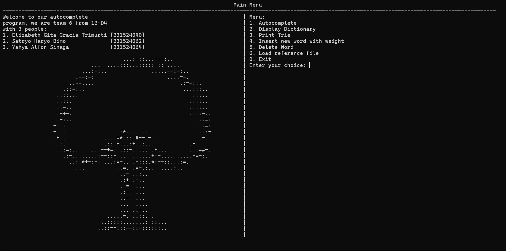

[![Contributors][contributors-shield]][contributors-url]

[![Forks][forks-shield]][forks-url]

[![Stargazers][stars-shield]][stars-url]

[![Issues][issues-shield]][issues-url]

[![MIT License][license-shield]][license-url]

<br />

<div  align="center">

<a  href="https://github.com/sumberdayac/autocompletion">


</a>

<h3  align="center">AUTOCOMPLETION with Trie</h3>

<p  align="center">

This program is a simple implementation of the Trie data structure for autocompletion. It allows users to input a list of words and then search for words that match a given prefix.

<br/>
<br/>

<a  href="#demo">View Demo</a>
·
<a  href="https://github.com/sumberdayac/autocompletion/issues">Report Bug</a>
·
<a  href="https://github.com/sumberdayac/autocompletion/issues">Request Feature</a>

</p>

</div>

## About The Project



### Built With

<!-- row images -->
<div>
  <a href="https://flutter.dev/">
    
  </a>
  <a href="https://flutter.dev/">
    
  </a>
</div>

## Getting Started

If you are using Visual Studio Code, you can also run the program by pressing `Ctrl+F5` to start debugging without any breakpoints.

To get started with this C project, follow these steps:

1. Clone the repository:

    ```bash
    git clone https://github.com/sumberdayac/autocompletion.git
    ```

2. Navigate to the project directory:

    ```bash
    cd autocompletion
    ```

3. Compile the source code:

    ```bash
    gcc main.c -o autocompletion
    ```

4. Run the program:

    ```bash
    ./autocompletion
    ```

Now you can use the autocompletion program and explore its features.

## Features

### 1. Add Words

You can add words to the autocompletion system by entering them one by one.

### 2. Search for Words

You can search for words that match a given prefix.

### 3. Delete Words

You can delete words from the autocompletion system.

### 4. Display Dictionary

You can display all the words in the autocompletion system.

### 5. Print Trie

You can print the Trie data structure that stores the words in the autocompletion system.

### 6. Load Words from File

You can load words from a file and add them to the autocompletion system.

## Created by Kelompok 6

- [Elizabeth Gita G.T](github.com/Elizabeth-tif)
- [Satryo Haryo Bimo](github.com/rioBMO)
- [Yahya Alfon Sinaga](github.com/codeyzx)

## License

Distributed under the MIT License. See `LICENSE.txt` for more information.

[contributors-shield]: https://img.shields.io/github/contributors/sumberdayac/autocompletion.svg?style=for-the-badge
[contributors-url]: https://github.com/sumberdayac/autocompletion/graphs/contributors
[forks-shield]: https://img.shields.io/github/forks/sumberdayac/autocompletion.svg?style=for-the-badge
[forks-url]: https://github.com/sumberdayac/autocompletion/network/members
[stars-shield]: https://img.shields.io/github/stars/sumberdayac/autocompletion.svg?style=for-the-badge
[stars-url]: https://github.com/sumberdayac/autocompletion/stargazers
[issues-shield]: https://img.shields.io/github/issues/sumberdayac/autocompletion.svg?style=for-the-badge
[issues-url]: https://github.com/sumberdayac/autocompletion/issues
[license-shield]: https://img.shields.io/github/license/othneildrew/Best-README-Template.svg?style=for-the-badge
[license-url]: https://github.com/sumberdayac/autocompletion/blob/main/LICENSE.txt
